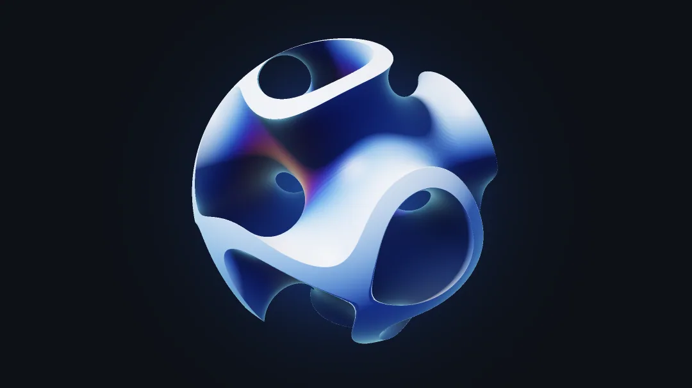

<div align="center">

<picture>
  <source media="(prefers-color-scheme: dark)"  srcset="assets/gyroid-dark.webp">
  <source media="(prefers-color-scheme: light)" srcset="assets/gyroid-light.webp">
  
</picture>

### Mau Nguyen

<sup>applied mathematics into systems that ship</sup>

**Not a stock GIF.** A signed-distance field, sphere-traced on a CPU in about
900 lines of numpy, re-rendered every six hours from the numbers on this account.

</div>

---

That shape is a **gyroid** — the triply periodic minimal surface Alan Schoen found
at NASA in 1970. Zero mean curvature everywhere, never self-intersecting, and its
entire definition is one line:

```math
\sin x \cos y + \sin y \cos z + \sin z \cos x = 0
```

The catch is that this is an *implicit* function, not a distance, so stepping by it
overshoots and tears holes in the surface. But every partial derivative is bounded,
which means dividing by the Lipschitz constant turns it into a **lower bound** on the
true distance — and a lower bound is all sphere tracing ever needed:

```math
d(\mathbf{p}) = \max\left(\frac{\bigl| g(f\mathbf{p}) \bigr| - \tau}{2\sqrt{3}f},\quad \lVert \mathbf{p} \rVert - R\right)
```

One inequality is the whole renderer. Everything else — normals from the gradient,
penumbra from the closest approach of a shadow ray, occlusion from where the field
falls short — is downstream of it.

<div align="center">

<picture>
  <source media="(prefers-color-scheme: dark)"  srcset="assets/card-dark.svg">
  <source media="(prefers-color-scheme: light)" srcset="assets/card-light.svg">
  
</picture>

</div>

<details>
<summary><b>How this page renders itself</b></summary>

<br>

GitHub markdown runs no JavaScript, so nothing here is live. The *assets* are: a
scheduled workflow re-renders them from the GitHub API and commits the result, and
the page just points at whatever is on disk.

**The geometry is your account.** Repository count sets how many lattice cells fit
in the ball, stars tilt the lattice inside it, and the commit count rotates the
colour palette:

<!-- gyroid:params -->
| symbol | meaning | driven by | current |
|:--|:--|:--|--:|
| $f$ | cell frequency of the gyroid lattice | public repositories | `3.2109` |
| $\alpha$ | tilt of the lattice inside the ball | stars received | `0.1146` |
| $\delta$ | palette rotation | commits $\times \varphi \bmod 1$ | `0.8804` |
| $\tau$ | shell half-thickness | pinned — see below | `0.3200` |
| $R$ | clipping ball radius | pinned | `1.2800` |

<sub>Rendered 2026-08-21 07:22 UTC from live GitHub data · 40 frames · 1080×608 at 2× supersampling · 176 march steps</sub>
<!-- /gyroid:params -->

Every input goes through `tanh`, so each parameter is bounded and monotone — growth
keeps moving the picture without ever pushing it out of the range that renders:
`f = 2.6 + 1.9·tanh(repos/24)`, `α = 1.15·tanh(stars/40)`. The palette step is
`δ = frac(commits · φ)`, golden ratio, because `φ` has the slowest continued-fraction
convergents of any irrational — successive commit counts land as far apart on the
colour wheel as a rotation can put them.

A parameter has to earn its wiring. It must be bounded and monotone, and **every
value in its range has to look good**, since an account does not get to choose where
it lands. Shell thickness `τ` failed a blunter test: it does nothing. The level sets
of a gyroid stay topologically stable across almost the whole usable range, so from
outside the ball a membrane and a slab are nearly the same picture — sweeping `τ`
from `0.06` to `0.80` is barely visible. It reads like a knob and controls nothing,
so it is pinned. The tilt replaced it because rotating the lattice genuinely changes
which cells the sphere cuts, and no angle is an ugly one.

**The loop does not crossfade.** Over one period the object turns through exactly
`2π` and the lattice phase advances by exactly one lattice vector. Both are exact
symmetries of the scene, so `frame(N) ≡ frame(0)` is an identity rather than an
approximation — the build asserts it every run and the two frames come out
bit-identical.

| file | what it is |
|:--|:--|
| [`render/raymarch.py`](render/raymarch.py) | the intersector: SDF, sphere tracing, normals, soft shadows, occlusion |
| [`render/scene.py`](render/scene.py) | shading, themes, camera, the seamless-loop construction |
| [`render/stats.py`](render/stats.py) | GraphQL with a REST fallback, and the statistics → geometry map |
| [`render/card.py`](render/card.py) | the terminal card, emitted as hand-written SVG |
| [`render/build.py`](render/build.py) | orchestration, WebP encoding, README patching |
| [`.github/workflows/render.yml`](.github/workflows/render.yml) | the cron |

Dependencies: `numpy`, `pillow`. No shader toolchain, no GPU, no renderer library.
Renders in well under a minute on a free runner.

Three GitHub-specific details worth stealing:

- **`<picture>` with `prefers-color-scheme`** is the only honest way to serve dark and
  light art. Both variants come from the same scene with different lighting rigs, not
  from inverting one image.
- **Backgrounds are GitHub's exact canvas colour, pre-inverted through the ACES tone
  curve** so they survive tone mapping. Skip that and the hero shows a visible
  rectangle edge instead of floating in the page.
- **Animated WebP** is about a fifth the size of the equivalent GIF at better quality,
  and degrades to a still frame rather than to nothing.

Fork it. The `scene_params` map is the only part that is about me.

</details>
