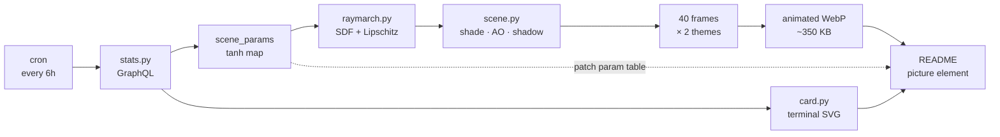

<picture>
  <source media="(prefers-color-scheme: dark)"  srcset="assets/gyroid-dark.webp">
  <source media="(prefers-color-scheme: light)" srcset="assets/gyroid-light.webp">
  
</picture>

### Mau Nguyen

applied mathematics into systems that ship

**That is not a stock GIF.** It is a signed-distance field, sphere-traced on a CPU,
re-rendered every six hours from the numbers on this account.

Everything below is the math that produced the picture above it.

---

## The surface

A **gyroid** — the triply periodic minimal surface Alan Schoen found at NASA in 1970.
It has zero mean curvature everywhere, it never self-intersects, and it partitions
space into two congruent interpenetrating labyrinths. Its short trigonometric
approximation is the whole scene:

$$
g(\mathbf{p}) \;=\; \sin p_x \cos p_y \;+\; \sin p_y \cos p_z \;+\; \sin p_z \cos p_x
$$

$$
\mathcal{G} \;=\; \lbrace\, \mathbf{p} \in \mathbb{R}^3 \;:\; g(\mathbf{p}) = 0 \,\rbrace
$$

What gets rendered is a shell of half-thickness $\tau$ around $\mathcal{G}$, clipped
to a ball of radius $R$, at lattice frequency $f$, tilted by $\mathbf{R}_\alpha$,
turned by the animation $\mathbf{R}_\theta$, and phase-shifted by $\phi$:

$$
d(\mathbf{p}) \;=\; \max\left(
  \frac{\bigl|\,g(f\mathbf{R}_\theta\mathbf{R}_\alpha\mathbf{p} + \phi)\,\bigr| - \tau}{2\sqrt{3}\,f},
  \;\; \lVert \mathbf{p} \rVert - R
\right)
$$

That denominator is the load-bearing part. $g$ is an *implicit* function, not a
distance — stepping by $g$ overshoots and tears holes in the surface. But every
partial derivative is bounded, $\lvert \partial_i g \rvert \le 2f$, so

$$
\lVert \nabla g \rVert \;\le\; 2\sqrt{3}\,f
$$

and dividing by that Lipschitz constant converts $g$ into a *lower bound* on the true
distance. A lower bound is all sphere tracing ever needed.

## The march

Step along each ray by the distance estimate. Because the estimate never exceeds the
real clearance, the point never tunnels through the surface:

$$
t_{n+1} \;=\; t_n + \lambda\, d(\mathbf{o} + t_n\boldsymbol{\omega}),
\qquad \lambda = 0.85
$$

Convergence when $d < \varepsilon$, escape when $t > t_\text{max}$. Rays leave the
working set the moment they do either, which is why 176 nominal steps costs far less
than 176 full-width passes — [`raymarch.py`](render/raymarch.py).

$\lambda < 1$ is not superstition. The Lipschitz bound is worst-case, and rays that
graze the shell tangentially skim it for a long way; at $\lambda = 1$ they punch
through and speckle the silhouette. The 15% haircut costs 8% of render time,
measured.

## The normal

No analytic normal, no mesh, no vertex data. The gradient of the field *is* the
normal, sampled by central differences — six extra evaluations per hit pixel:

$$
\mathbf{n} \;=\; \frac{\nabla d}{\lVert \nabla d \rVert},
\qquad
\partial_i d \;\approx\; \frac{d(\mathbf{p} + h\mathbf{e}_i) - d(\mathbf{p} - h\mathbf{e}_i)}{2h}
$$

## The light

**Soft shadows** never trace a light disc. March toward the light and track the
closest approach, scaled by how far you have come — a ray that passes near geometry
early is deep in penumbra, one that passes near it late is barely grazed:

$$
s \;=\; \min_{t \in [t_0,\,t_1]} \operatorname{clamp}\left( \frac{k\,d(\mathbf{p} + t\boldsymbol{\omega}_L)}{t},\, 0,\, 1 \right)
$$

**Ambient occlusion** walks a short way along the normal and asks how much the field
disagrees with the distance travelled. Where geometry crowds in, $d$ falls short:

$$
\mathrm{ao} \;=\; \operatorname{clamp}\left( 1 - \kappa \sum_{i=0}^{4} \bigl(h_i - d(\mathbf{p} + h_i \mathbf{n})\bigr)\, \sigma^i,\, 0,\, 1 \right)
$$

**Colour** is a cosine gradient — four RGB triples generate the entire palette, and
$\mathbf{d}$ is the knob the commit count turns:

$$
\mathbf{c}(u) \;=\; \mathbf{a} + \mathbf{b} \odot \cos\bigl(2\pi(\mathbf{c}u + \mathbf{d})\bigr)
$$

**Tone mapping** is Narkowicz's rational fit to the ACES filmic curve, then gamma
$1/2.2$. Shading happens in linear light; only the last line of the renderer is sRGB.

## The loop

The animation does not crossfade back to the start. Over one period the object turns
through exactly $2\pi$ about $\hat{y}$, and the gyroid phase advances by exactly one
lattice vector $\tfrac{2\pi}{f}(1,1,1)$. Both are exact symmetries of the scene, so

$$
\text{frame}(N) \;\equiv\; \text{frame}(0)
$$

is an identity, not an approximation. The build asserts it — the two frames come out
bit-identical, maximum channel difference `0`.

## The parameters

<!-- gyroid:params -->
| symbol | meaning | driven by | current |
|:--|:--|:--|--:|
| $f$ | cell frequency of the gyroid lattice | public repositories | `3.2109` |
| $\alpha$ | tilt of the lattice inside the ball | stars received | `0.1146` |
| $\delta$ | palette rotation | commits $\times\ \varphi \bmod 1$ | `0.0000` |
| $\tau$ | shell half-thickness | pinned — see below | `0.3200` |
| $R$ | clipping ball radius | pinned | `1.2800` |

Rendered 2026-08-20 04:17 UTC from live GitHub data · 40 frames · 720×405 at 2× supersampling · 176 march steps
<!-- /gyroid:params -->

Each input is squashed through $\tanh$, which is monotone and bounded — the geometry
keeps responding to growth forever without ever leaving the range where the surface
actually reads:

$$
f = 2.6 + 1.9\tanh\left(\frac{\text{repos}}{24}\right)
\qquad
\alpha = 1.15\tanh\left(\frac{\text{stars}}{40}\right)
$$

$$
\delta = \bigl(\text{commits} \cdot \varphi\bigr) \bmod 1,
\qquad \varphi = \tfrac{1 + \sqrt{5}}{2}
$$

The golden ratio is there because $\varphi$ has the slowest continued-fraction
convergents of any irrational, so successive commit counts land as far apart on the
colour wheel as an irrational rotation can put them. The palette never repeats and
never clusters.

A parameter has to clear two bars to get wired to a statistic. It must be **bounded
and monotone**, so growth keeps moving the picture without ever pushing it out of the
range that renders — that is what $\tanh$ is for. And **every value in its range has
to look good**, because an account does not get to choose where it lands.

Shell thickness $\tau$ fails a third, blunter test: it does nothing. The level sets
$\lvert g \rvert = \tau$ of the gyroid stay topologically stable across almost the
whole usable range, so from outside the clipping ball a membrane and a slab are very
nearly the same picture — sweeping $\tau$ from $0.06$ to $0.80$ is barely visible.
It reads like a knob and controls nothing, so it is pinned to a constant. The tilt
$\alpha$ replaced it because rotating the lattice inside the ball genuinely changes
which cells the sphere cuts, and no angle is an ugly one.

## The pipeline

---

<picture>
  <source media="(prefers-color-scheme: dark)"  srcset="assets/card-dark.svg">
  <source media="(prefers-color-scheme: light)" srcset="assets/card-light.svg">
  
</picture>

<b>How this page renders itself</b>

 

GitHub markdown runs no JavaScript, so nothing on this page is live. The *assets*
are — a scheduled workflow re-renders them and commits the result, and the page
simply points at whatever is on disk.

| file | what it is |
|:--|:--|
| [`render/raymarch.py`](render/raymarch.py) | the intersector: SDF, sphere tracing, normals, soft shadows, occlusion |
| [`render/scene.py`](render/scene.py) | shading, themes, camera, the seamless-loop construction |
| [`render/stats.py`](render/stats.py) | GraphQL query and the statistics → geometry map |
| [`render/card.py`](render/card.py) | the terminal card, emitted as hand-written SVG |
| [`render/build.py`](render/build.py) | orchestration, WebP encoding, README patching |
| [`.github/workflows/render.yml`](.github/workflows/render.yml) | the cron |

Dependencies: `numpy`, `pillow`. No shader toolchain, no GPU, no renderer library.
The whole thing is about 950 lines and renders in well under a minute on a free runner.

Two GitHub-specific details worth stealing:

- **`<picture>` with `prefers-color-scheme`** is the only honest way to serve dark
  and light art. Both variants are rendered from the same scene with different
  lighting rigs, not by inverting one image.
- **Animated WebP** is roughly a fifth the size of the equivalent GIF at visibly
  better quality, and degrades to a still frame rather than to nothing.

Fork it. The mapping in `scene_params` is the only part that is about me.

